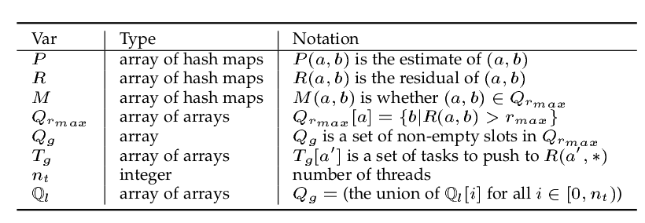

# PRLP & PFLP

description | detail
--- | ---
notations/symbols | 
prlp | 
prlp: task gen | 
prlp: local push comp | 

## Parallelization Design

* smallest task: `a'`, `b` (to be expanded), `residual_value`, `flag` (for the reduced linear system)
* requirement: `a'` grouped together before submitting tasks
* some difference in the rlp parallelization

## Implementation Optimization Tricks

* adopt bidirectional csr(better memory access)
* adopt `tcmalloc`(thread-local cache memory) to replace glibc's `malloc`

## Usage

```zsh
./rlp ca-GrQc 0.01
./flp ca-GrQc 0.01
```

## Dir Organization

util | files
--- | ---
graph(bidirectional csr) | [graph_yche.h](util/graph_yche.h), [graph_yche.cpp](util/graph_yche.cpp)
spare matrix | [sparse_matrix_utils.h](util/sparse_matrix_utils.h)
file serialization | [file_serialization.h](util/file_serialization.h)
profiling | [stat.h](util/stat.h), [stat.cpp](util/stat.cpp)

all pair algorithms | files
--- | ---
prlp-with-lock | [parallel_local_push_yche_rlp.cpp](yche_refactor/parallel_local_push_yche_rlp_with_lock.cpp)
prlp-lock-free | [parallel_local_push_yche_rlp_lock_free.cpp](yche_refactor/parallel_local_push_yche_rlp_lock_free.cpp)
pflp-with-lock | [parallel_local_push_yche.cpp](yche_refactor/parallel_local_push_yche.cpp)
flp | [local_push_yche.h](yche_refactor/local_push_yche.h), [local_push_yche.cpp](yche_refactor/local_push_yche.cpp)
rlp | [local_push_yche_rlp.cpp](yche_refactor/local_push_yche_rlp.cpp)
iterative(ground truth) | [simrank.h](yche_refactor/simrank.h), [simrank.cpp](yche_refactor/simrank.cpp)

## Build

```zsh
mkdir build
cd build
cmake ..
make -j
```
